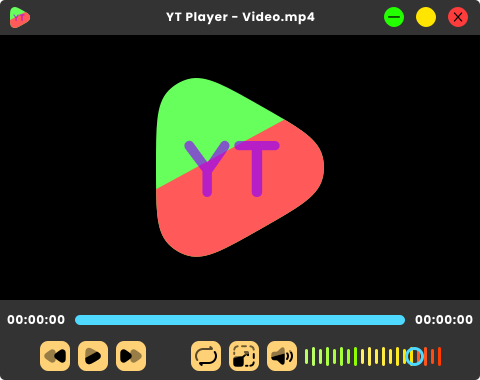

# YT Player

<b>This is a free and open source video and audio player.</b>

## Downloads

- [Download for windows](https://www.google.com)
- [Download for linux](https://www.google.com)

## Features

- Stylish And Color Full Design 🤩
- High Quality Graphics - GPU Render 🔥
- Simple And Minimalastic For High Speed 🚀
- Cross Platform  

## Author

<b>Ahmed Alam</b>
|
[@mahmedalam](https://github.com/mahmedalam)