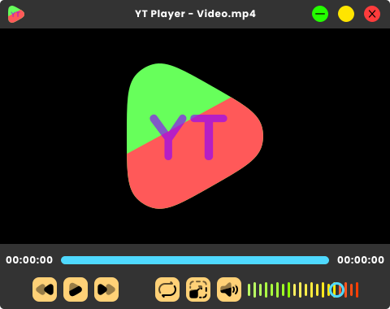

# GenZ Player

**A media player that just plays your files without any bloat :)**



[](https://opensource.org/licenses/MIT)
[](https://www.python.org/)
[](https://pypi.org/project/PyQt6/)
[](#)

## Downloads

| Platform   | Link                      |
| ---------- | ------------------------- |
| 🪟 Windows | [Download for Windows](#) |
| 🐧 Linux   | Coming soon               |

> **Security note:** The Windows `.exe` is not digitally signed thats why download happen only from github release, so you can trust 😵‍💫.

## Features

- 🤩 **Stylish, Colorful and Bloat Free UI** — a polished interface that feels great to use
- 🔥 **GPU Rendering** — smooth and high quality video playback
-   **Cross Platform** — runs on Windows and Linux

## Keyboard Shortcuts

| Key     | Action             |
| ------- | ------------------ |
| `Space` | Play / Pause       |
| `←`     | Rewind 5 seconds   |
| `→`     | Forward 5 seconds  |
| `↑`     | Volume up          |
| `↓`     | Volume down        |
| `M`     | Toggle mute        |
| `F`     | Toggle full screen |
| `Q`     | Quit               |

## Installation

### Option 1 — Download a release (recommended)

Download the portable exe from the [Downloads](#downloads) section above.

### Option 2 — Run from source

**Requirements:** Python 3.14+

```bash
# Clone the repository
git clone https://github.com/xahmedalam/genzplayer.git
cd genzplayer

# Install dependencies
pip install -r requirements.txt

# Launch the player
python main.py
```

To open a specific file directly:

```bash
python main.py /path/to/your/video.mp4
```

### Option 3 — Build your own executable

The project uses [PyInstaller](https://pyinstaller.org/) for packaging.

```bash
pip install pyinstaller
pyinstaller --onefile --windowed --icon="GenZ Player.ico" main.py
```

The compiled executable will be in the `dist/` folder.

## Project Structure

```
genzplayer/
├── main.py              # Application entry point & main window
├── interface.py         # UI layout and widget setup
├── custom_widgets.py    # Custom PyQt6 widgets
├── style.py             # Application stylesheet (CSS-in-Python)
├── shortcuts.py         # Keyboard shortcuts dialog
├── author.py            # Author info dialog
├── fonts.py / font.py   # Embedded font data
├── resources.py         # Bundled assets (icons, images)
├── settings.json        # Persistent user settings
└── requirements.txt     # Python dependencies
```

## Dependencies

| Package     | Version | Purpose                            |
| ----------- | ------- | ---------------------------------- |
| PyQt6       | 6.10.2  | UI framework & multimedia playback |
| PyInstaller | 6.19.0  | Packaging to standalone executable |
| clipboard   | 0.0.4   | Clipboard utilities                |

See [`requirements.txt`](requirements.txt) or [`pyproject.toml`](pyproject.toml) for the full list.

## Contributing

Contributions are welcome! Here's how to get involved:

1. **Fork** the repository
2. **Create** a feature branch: `git checkout -b feature/your-feature`
3. **Commit** your changes: `git commit -m "Add your feature"`
4. **Push** to your branch: `git push origin feature/your-feature`
5. **Open a Pull Request** — I will review it

Please make sure your changes don't introduce any proprietary dependencies, and keep the code style consistent with the existing codebase.

## Reporting Issues

Found a bug or have a feature request? [Open an issue](https://github.com/xahmedalam/genzplayer/issues) on GitHub. Please include your OS, Python version, and steps to reproduce.

## Author

**Ahmed Alam** — [@xahmedalam](https://x.com/xahmedalam)

## License

This project is licensed under the **MIT License**. See the [LICENSE](LICENSE) file for details.

---

_Built with ❤️ using Python & PyQt6_
